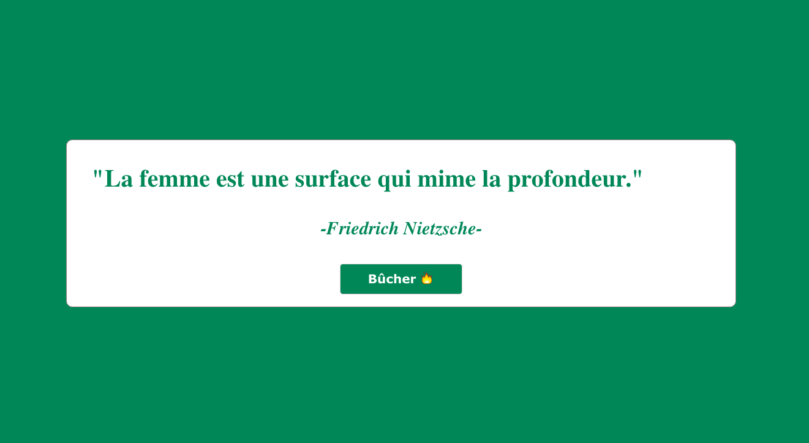
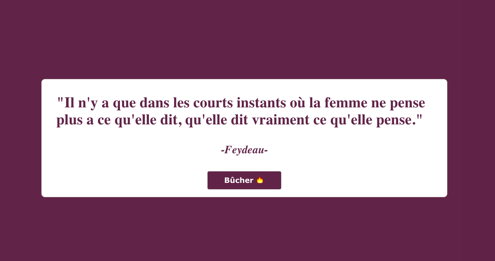

This project was bootstrapped with [Create React App](https://github.com/facebook/create-react-app).

## To access to the simulator : https://quote-generator-miso.herokuapp.com/

## What's this ?

For fun and to practice react.js while giving vent to my frustration of living in a lingering patriarchal atmosphere,  I created this simple quote generator. All the quotes are from well-known French litteratures icons.

## You are more than welcome to participate and contribute in adding ressources, fuel the debate or ask any questions.
The project is in a public repo for this purpose. The database with the quotes is here : https://github.com/JenniferStephan/quotegenerator/blob/master/src/QuotesDatabase.js
Please feel free to send any pull request.

